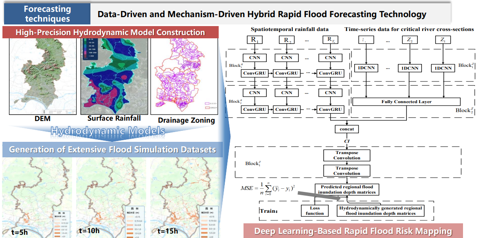
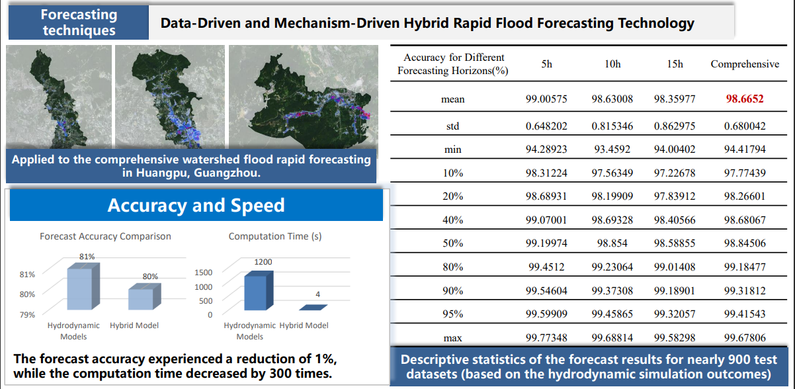

# 数据驱动与机理驱动耦合的洪涝快速预报模型研究与应用

## 引言

## 方法

### ConvLSTM基本原理

### 模型构建

（在convlstm的基础上，构建降雨-河道水位初始场的端到端预报模型 模型拓扑结构图）

明确模型的计算流程 及 输入输出

### 模型设置及参数设定

#### 水动力模型

水动力参数

#### 神经网络模型

神经网络参数、模型的结构以及损失函数，评估方法等

### 基线模型与方法

选择水动力模型、CNN、CNN-LSTM作为基线模型，评估模型的性能。

对水动力模型、CNN、CNN-LSTM、ConvLSTM进行效果比对。

### 研究案例

交代研究区域的基本情况：南岗河；金坑河；

降雨情景的生成方法

河道水位初始场的生成方法（符合河流的水面线自然规律）

## 模拟结果与分析

### 模型优化

不同输入时间步长、不同预见期、不同batch_size对于模型预报精度的评估

考虑 河道水位初始场 与不考虑河道水位初始场 作为模型输入，对模型精度的影响。

### 与基线模型的比对分析

从不同评估指标（MSE NSE 计算时长）等分析本模型的优越性；

从总体样本 典型样本入手。

### 模型在不同流域的应用

南岗河：城市型

流溪河：山区流域

金坑河：平原地区

## 结论

深入研究机器学习、深度学习、强化学习、GPU并行计算等最前沿的人工智能大数据处理技术，构建包括大数据治理、整编、管理的技术体系框架，实现基于特征因子自挖掘的人工智能模型自适应预测技术体系框架，应用于高精度的河道水位预报、易涝点积水智能预报及高密度城市洪涝过程快速预报。上述技术在数字孪生南岗河已有初步成效，其中基于人工智能的河道断面水位预报的预报精度在两小时遇见期内可达到80%以上（乙级，且已纳入了气象预报的不确定性）；高密度城市洪涝过程快速预报可实现预见期为12h的全流域30万网格逐0.5h的淹没水深秒级快速预报（预见期长度、预测步长、网格精细程度取决于精细化水动力模型的构架），以水动力的模拟成果为评判标准，预计精度可达90%以上。上述大数据管理框架及基于人工智能的预报模型体系框架，为数字孪生流域数据地板的构建提供高效的技术手段，并实现由点到面为高密度城市的洪涝快速、精准预报提供全新的技术方案，以支持城市防洪、水资源管理和紧急决策。

